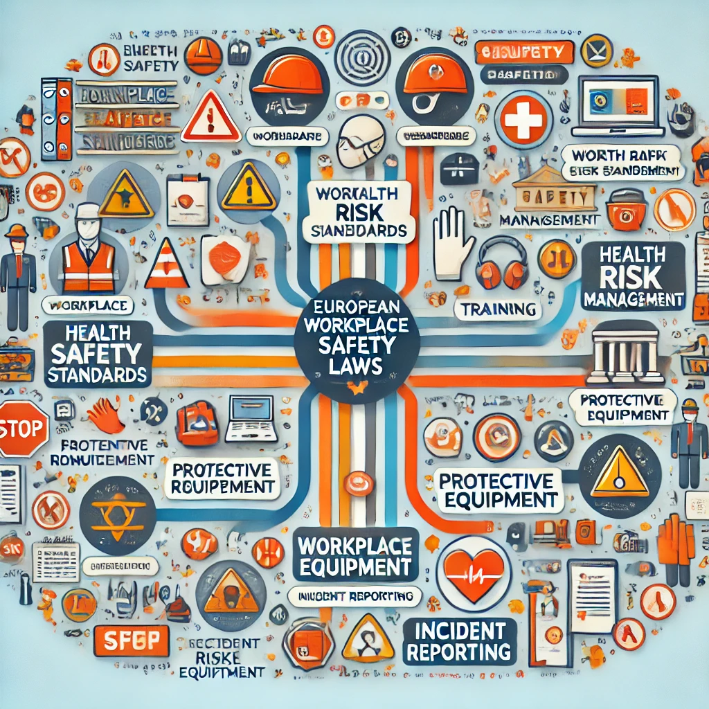

## Regulaciones y Legislación en Europa Sobre Seguridad Laboral

### Directiva Marco 89/391/CEE

Esta normativa es el pilar fundamental de la seguridad laboral en **Europa**. Se forma por normas generales y se encarga de definir las responsabilidades tanto de los **empleadores** como de los **trabajadores**:

-**Emprendedores**:

- Se encargan de evaluar los riesgos en el lugar de trabajo
- Implementar medidas preventivas 
- Proporcionar información adecuada y formación 

-**Trabajadores**: 

- Siguen las instrucciones de los emprendedores
- Utilizar bien los equipos de protección laboral **(EPP)**
- Informar sobre cualquier riego laboral

## Normas específicas

Existen una serie de normas especificas para cada servicio por la **Organización Internacional Del Trabajo (OIT)**. Unos ejemplos serían;

- **Para sustaciones peligrosas y agentes biológicos** (Químicos, agentes biológicos en general)
- **Para el espacio y ambientes de trabajo:** es esencial tener buenos diseños de la maquinaria para que haya suficientes espacios de trabajo para los trabajadores
- **Para la prevención de riesgos físicos** (ruido, vibraciones, radiaciones ópticas...)
- **Carga Física** (evitar trastornos musculoesqueléticos)

  
